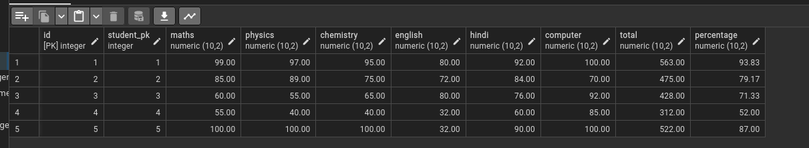

# packages : 
Creating and using packages are covered.  
The following packages that are created and then used in main.py file are as follows : 
1. drivers
2. dictionary
3. list_custom [List comprehension]
4. loop [break, continue, range]
5. operators
6. sets
7. strings [regex library]
8. tuples   

# classes, constructors, (getters and setters), methods, private variables, __private methods, Abstraction , Type casting:
[Classes,constructors, (getters and setters), methods, Abstraction, Type casting] have been used in all the files inside packages as listed below : 
1. drivers
2. dictionary
3. list_custom [List comprehension]
4. loop [break, continue, range]
5. operators
6. sets
7. strings [regex library]
8. tuples  

# Inheritance, Polymorphism, Encapsulation, Class variables:
[Inheritance, Polymorphism, Encapsulation, Class variables] have been used in the solution.py file inside a class_oop folder :  
NOTE: class_oop is not a package it's just a folder
1. solution.py

# magic methods:
Magic methods are those methods that can't be created by us but we can use them to create some new things to meet our requirements for example creating a fraction datatype:
used in Operator package in files as listed below : 
1. fraction  
2. fraction_calculator (used this fraction datatype in here) 

# conditional statements, loops [break, range] and Exceptions: 
Conditional statements are used to drive menu driven programs
the files where conditional statements are used are listed below : 
### Stand alone files
1. main.py 
### Packages : 
A. drivers : files inside this package uses conditional statements and loops to drive the menu system :
1. driver_dictionary 
2. driver_list
3. driver_loop
4. driver_operator
5. driver_sets
6. driver_string
7. driver_tuples  
  
B. operators : files inside this package uses conditional statements and loops to drive the menu system :
1. calculator
2. fraction_calculator
3. unit_converter

# generators : 
generator folder is not a package it's a simple folder that contains some examples of generators: 
1. example_0
2. example_1
3. example_2

# args and kwargs : 
args_kwargs folder holds the programs related to args and kwargs:
args_akwargs :
1. example_0
2. example_1  
A. args  
1. example_1
2. example_2
3. example_3  
B. kwargs
1. example1
2. example2
3. example3

# decorators [@property, @classmethod, @staticmethod, @name.setter]:
decorators folders holds the files that demonstrate how to use python decorators.  
It is inside a folder called simple_folder : 
1. item
2. main
3. phone

# dictionary and dictionary comprehension :
dictionary package contains all the programs related to dictionary and dictionary comprehension :  
A. dictionary  
1. dictionary_comprehension [single and nested dictionary comprehension]

# [creating a date object, current date, date output , date formatting] dates : 
python dates are in a folder called dates inside simple_folders :  
A. simple_folders  
1. dates

# os module:
os module folder is inside simple_folders
1. change_directory
2. create_directory
3. create_multiple_directories
4. delete_directory_files
5. get_current_working_directory
6. get_os_name
7. list_files_directories
8. os_errors
10. read_write_files
11. rename_files
12. remove_files
13. check_if_path_exists
14. get_file_size

# Postgres Database : 
### create a table with a column of primary key with auto increment 
```
(normally)
CREATE TABLE YourTableName (
    id INT IDENTITY(1,1) PRIMARY KEY,
    other_column VARCHAR(255),
    another_column INT
);

(in case of postgres)
CREATE TABLE IF NOT EXISTS student (
	id SERIAL PRIMARY KEY,
	student_name VARCHAR(50),
	roll_number INT
);
```

### create a table with a column of primary key and foreign key
```
CREATE TABLE parent_table (
    parent_id SERIAL PRIMARY KEY,
    parent_name VARCHAR(100)
);

CREATE TABLE child_table (
    child_id SERIAL PRIMARY KEY,
    child_name VARCHAR(100),
    parent_id INT REFERENCES parent_table(parent_id)
);
```
### alter an existing table to add a constraint in a column
```
CREATE TABLE IF NOT EXISTS student_profile (
	id SERIAL PRIMARY KEY,
	student_pk INT REFERENCES student(id),
	address VARCHAR(255),
	phone_number BIGINT
);

INSERT INTO student_profile(student_pk, address, phone_number) VALUES
(1,'Lucknow',8887634464),
(2,'Chandigarh',9451907083),
(3,'Kolkata',9451907102),
(4,'Chennai',8004224178),
(5,'Mumbai',8896298052);
ALTER TABLE student_profile
ADD CONSTRAINT unique_student_pk UNIQUE (student_pk);
```
### stodred procedures
```
/*
table (parent table) with auto-increment primary key column
create, insert and select all 
*/
CREATE TABLE IF NOT EXISTS student (
	id SERIAL PRIMARY KEY,
	student_name VARCHAR(50),
	roll_number INT
);
/*
CREATE a stored procedure for student table
INSERT , SELECT_ALL, UPDATE, DELETE
*/
CREATE OR REPLACE PROCEDURE insert_student(
	IN student_name_var VARCHAR(50),
	IN roll_number_var INT
)
LANGUAGE SQL
AS $$
INSERT INTO student(student_name, roll_number) VALUES
(student_name_var, roll_number_var);
$$;

CREATE OR REPLACE PROCEDURE select_all_student()
	RETURNS TABLE(id int, student_name VARCHAR(50), roll_number = INT)
LANGUAGE SQL
AS $$
SELECT * FROM student;
$$;

CREATE OR REPLACE PROCEDURE update_student(
	IN id_var INT,
	IN student_name_var VARCHAR(50),
	IN roll_number_var INT
)
LANGUAGE SQL
AS $$
UPDATE student SET student_name = student_name_var , roll_number = roll_number_var WHERE id = id_var;
$$;

CREATE OR REPLACE PROCEDURE delete_student(
	IN id_var INT
)
LANGUAGE SQL
AS $$
DELETE FROM student WHERE id = id_var;
$$
/*
CALL stored procedures for student table
INSERT , SELECT_ALL, UPDATE, DELETE
*/
CALL insert_student('Dynamite', 911);
CALL update_student(7,'Kombat', 365);
CALL delete_student(7);

CALL select_all_student(); --The stored procedures in postgres do not return a table It only happen in Microsoft SQL
SELECT * FROM student;
```
### Use stored procedures along with triggers
create a table named student_marks:  
```
CREATE TABLE IF NOT EXISTS student_marks (
	id SERIAL PRIMARY KEY,
	student_pk INT REFERENCES student(id),
	maths NUMERIC(10,2),
	physics NUMERIC(10,2),
	chemistry NUMERIC(10,2),
	english NUMERIC(10,2),
	hindi NUMERIC(10,2),
	computer NUMERIC(10,2),
	total NUMERIC(10,2),
	percentage NUMERIC(10,2)
    );
```  
trigger to detect the insert operation on student_marks table  
```
CREATE TRIGGER calculate_marks_and_percentage
BEFORE INSERT ON student_marks
FOR EACH ROW
EXECUTE FUNCTION calculate_total_and_percentage();
```  
stored procedure to calculate the total and percentage of the marks present in a student_marks table  
```
CREATE OR REPLACE FUNCTION calculate_total_and_percentage()
RETURNS TRIGGER AS $$
BEGIN
    NEW.total := NEW.maths + NEW.physics + NEW.chemistry + NEW.english + NEW.hindi + NEW.computer;
    NEW.percentage := (NEW.total / 600) * 100; -- Assuming total marks for all subjects is 600
    RETURN NEW;
END;
$$ LANGUAGE plpgsql;
```  
Now if we insert something in the table then the total marks and percentage will be calculated before the insert operation takes place in the database  
```
INSERT INTO student_marks (student_pk, maths ,physics ,chemistry ,english ,hindi ,computer ) VALUES
(1,99,97,95,80,92,100),
(2,85,89,75,72,84,70),
(3,60,55,65,80,76,92),
(4,55,40,40,32,60,85),
(5,100,100,100,32,90,100);

SELECT * FROM student_marks
```  
output:  

